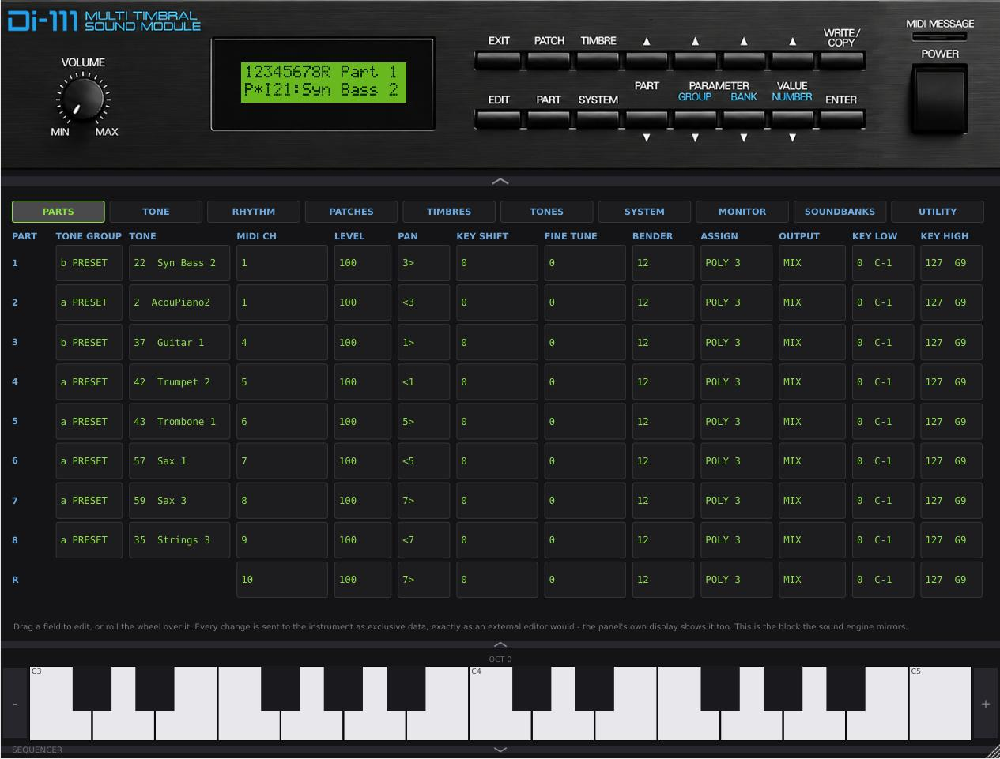

# D-110 VST Emulator

A VST3 plugin that emulates the Roland D-110 multi-timbral sound module.



**It runs the D-110's real Roland firmware** - the menus, the display, the patch/timbre editors
and all sixteen front-panel buttons are the hardware's own, not a reimplementation - against an
emulated LA32 sound engine ([munt](https://github.com/munt/munt)). The plugin opens already
switched on, exactly like the hardware. See [`docs/architecture.md`](docs/architecture.md) for
how the two halves fit together, what the extended editor drawer does, and known limits.

## Get started

You need your own **D-110 ROM dumps** - copyrighted Roland firmware, **not included** here.
You can get them here: [https://mdk.cab/download/standalone/d110.7z](https://mdk.cab/download/standalone/d110.7z)

Put the files loose (not zipped) into:

- Windows: `C:\Program Files\Common Files\VST3\D-110 Data\`
- macOS: `~/Library/Audio/Plug-Ins/VST3/D-110 Data/`
- Linux: `~/.vst3/D-110_Data/`

(Using the Standalone app rather than a DAW? `%APPDATA%\D-110 Emulator\D-110 Data\` /
`~/Library/Application Support/D-110 Emulator/D-110 Data/` / `~/.config/D-110 Emulator/D-110 Data/`
works too - see [`docs/roms.md`](docs/roms.md).)

Right-click the panel to see what was recognised. Full requirements, checksums, and what to do
if you only have `D-110_PCM.bin`/`D-110_Control.bin`: [`docs/roms.md`](docs/roms.md).

The doc in pdf format for the synthesizer is located at [https://cdn.roland.com/assets/media/pdf/D-110_OM.pdf](https://cdn.roland.com/assets/media/pdf/D-110_OM.pdf)

## Build

Requires CMake and a C++ compiler (Visual Studio Build Tools on Windows; GCC and
`libsdl2-dev libsdl2-ttf-dev libfontconfig1-dev libpulse-dev` on Debian/Ubuntu). JUCE is
fetched automatically by CMake on first configure.

```
cd plugin
cmake -B build -S .
cmake --build build --config Release
```

This builds `D110EmulatorNative` - the default, MAME-free backend - and copies the `.vst3` to
your platform's shared VST3 folder automatically. For the opt-in MAME-backed backend and full
build details, see [`docs/building.md`](docs/building.md).

## More documentation

- [`docs/architecture.md`](docs/architecture.md) - how it works, the extended editor, firmware
  memory vs. plugin settings, the memory card slot, known limits.
- [`docs/sequencer.md`](docs/sequencer.md) - the D-20-style multitrack sequencer: tracks and
  channels, transport, real-time and step recording, quantize, bar editing, undo, song slots,
  MIDI Out, and the independent sequencer app (no firmware/ROMs needed at all).
- [`docs/roms.md`](docs/roms.md) - full ROM requirements, checksums, factory defaults, and
  re-initializing the firmware.
- [`docs/building.md`](docs/building.md) - full build details, including the opt-in MAME-backed
  `D110Emulator`.
- [`docs/project_layout.md`](docs/project_layout.md) - what each source folder and probe/test
  tool is for.
- [`docs/sysex_address_map.md`](docs/sysex_address_map.md) - the firmware RAM map and what is
  (and isn't) mirrored to the sound engine.
- [`docs/panel_reference_notes.md`](docs/panel_reference_notes.md),
  [`docs/memory_card.md`](docs/memory_card.md),
  [`docs/factory_defaults.md`](docs/factory_defaults.md) - measured ground truth referenced by
  the code.
- [`docs/host_compatibility.md`](docs/host_compatibility.md) - the optional JACK MIDI input port
  (Linux Standalone), and known VST3 hosting quirks in specific DAWs (Ardour/Carla/Qtractor).
- [`docs/android.md`](docs/android.md) - the Android port (Standalone only): what's implemented,
  how to build it, and how to place ROM files on-device.
- [`Roland-D110.idf`](Roland-D110.idf) - a MusE instrument definition with all 128 factory Patch
  names, measured off the real firmware rather than copied from a manual.

## Legal Notice

This is an independent open-source software project. It is not affiliated
with, endorsed by, sponsored by, or approved by Yamaha Corporation, Roland
Corporation, Ensoniq Corporation, or any other trademark owner. All
trademarks remain the property of their respective owners.

No copyrighted Roland firmware, ROM images, or other proprietary binary
files are included in or distributed with this repository - you must
obtain and supply your own legally acquired Control ROM and PCM Wave ROM
dumps (see [Get started](#get-started) above).

This project incorporates third-party open-source code (munt/mt32emu,
JUCE); all original copyright notices and license headers have been
preserved. See:

- [LICENSE](LICENSE) - this project's own license (AGPLv3)
- [THIRD_PARTY_LICENSES.md](THIRD_PARTY_LICENSES.md) - full third-party license details
- [CREDITS.md](CREDITS.md) - acknowledgements
- [DISCLAIMER.md](DISCLAIMER.md) - the full disclaimer text
