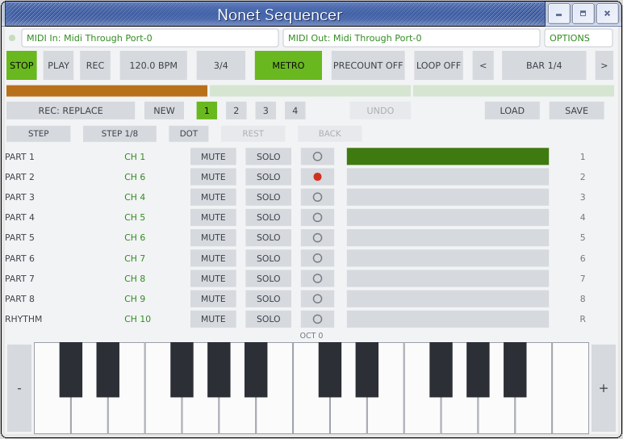

# The sequencer

A D-20-style multitrack MIDI sequencer, the third foldable drawer under the D-110 panel
(alongside the extended editor and the on-screen test keyboard), closed by default. It has
its own internal clock - it is **not** synced to the host's tempo or transport, the same way
the original hardware's own sequencer wasn't - so it behaves identically in the VST3 and the
Standalone build.

**It also exists as a fully independent standalone app, with no D-110/firmware/ROM
dependency at all: Nonet Sequencer (binary `Nonet-Seq`).** Same engine, same panel, same
feature set described below - see [Nonet Sequencer - the independent app](#nonet-sequencer---the-independent-app)
further down for what's different about running it on its own.

The engine (`plugin/Source/sequencer/D110SequencerEngine.h/.cpp`) is deliberately D-110-agnostic:
it only knows about MIDI channels, beats and note events, not firmware RAM, so none of this
depends on the emulator underneath it. The UI (`D110SequencerPanel.h/.cpp`) is the only piece
that talks to the rest of the plugin, through a `channelForTrack` callback.

## Tracks and channels

9 tracks: **Part 1-8**, then **Rhythm** (16 in Nonet Sequencer, with extra tracks on - see
below). A track is not free-standing - it always plays on
whatever MIDI channel the corresponding D-110 part is *currently* set to on the SYSTEM page
(Rhythm is fixed on channel 10). This is read live at playback time, not stored per event, so
re-routing a part's channel on the Parts/System tab immediately changes which channel that
track's already-recorded notes come out on - and it's what makes copying notes from one track
to another (see **Copy bar(s)**, below) carry only the pitch/timing across, never the channel.
**In Nonet Sequencer** (see below), which has no SYSTEM page to read a channel map from,
the channel readout is clickable instead - a 1-16 picker per track, shown in a different
colour from the plugin's own read-only readout so it reads as a control there.

Each row: **MUTE**, **SOLO** (soloing any track silences every non-soloed one), **ARM** (record-
enable, drawn as a small record-style dot - filled red while armed, a hollow ring otherwise;
arming one track disarms whatever else was armed; arming mid-take commits that take first
rather than discarding it), a channel readout, and a filled/empty bar showing whether the track
has any recorded events. The far right of each row carries a bare digit ("1".."8", or "R" for
rhythm) that always identifies the part, independent of whatever the row's own label is showing.

That label is "PART N"/"RHYTHM" by default, but **right-click anywhere on a row for Rename
track...** to give it a name of your own - shown here in place of the default label, and
written into the track as a Track Name meta-event when exporting to `.mid` (falling back to
the default label if never renamed, so an exported file's tracks are never left anonymous).
Names round-trip: importing a `.mid` picks up whatever track names it already carries, and
they're saved/restored with the rest of a song's state as usual. The same right-click menu
also carries quantize and the destructive per-track operations (clear/delete/copy/transpose
bars, below).

## Transport

**STOP** / **PLAY** / **REC**, a draggable **TEMPO** field (20-300 BPM; drag vertically, mouse
wheel, or right-click to type an exact BPM), a **TAP** button right next to it (click it a few
times at the beat you want - two or more taps within 2 seconds of each other average into a
live tempo via `D110SequencerEngine::registerTapTempo()`; a longer pause starts a fresh tap
sequence instead of corrupting the average with a stray tap), a **time signature** field (click
cycles six presets - 4/4, 3/4, 6/8, 2/4, 5/4, 7/8 - right-click picks one directly, or picks
**Custom...** to type any numerator/denominator from 1-32), and bar navigation (prev/next
buttons, a draggable **BAR n/total** readout).

**STOP** always sends a MIDI panic (all notes off on every channel) as well as halting the
transport, so a note whose off was scheduled past the stop point (renderInto() stops walking the
sequence the instant playback halts) never gets left stuck sounding, or stuck showing as an
active voice on the Monitor tab.

**Right-click STOP sends that same MIDI panic** without stopping the transport - a quick way out
of a stuck note without waiting for the take to end.

**Right-click PLAY starts from the beginning** (bar 1) instead of resuming from wherever the
transport currently sits.

Right-click the **BAR** readout for: *Go to bar...*, *Set punch in/out here* or *...*, and the
all-tracks forms of **Delete bar(s)**, **Copy bar(s) to...** and **Transpose bar(s)** (see
below).

### Metronome, precount, loop and punch

**METRO** toggles the metronome; right-click it for *Visual only* (an LED strip under the
transport) / *Audio only* / *Both*, whether it also fires real notes on the rhythm channel
instead of (or alongside) its own click sound, whether it's silent during plain playback and
only sounds while recording, and a volume submenu (25-150%).

**PRECOUNT** cycles 0 -> 1 -> 2 bars of click-only lead-in before a take actually starts
capturing. The count-in is *fictitious*: it never advances the bar counter, so a take always
starts on the bar you navigated to, not however many bars later.

**LOOP** cycles OFF -> BAR (repeats whatever bar you're on) -> PUNCH (loops the
[punch-in, punch-out] range set from the BAR readout's right-click menu). While **LOOP: PUNCH**
is active, recording is additionally *restricted* to that same range - notes played outside it
are not captured.

## Recording

### Real-time

Arm a track, press **REC** (or click it while stopped - REC starts the transport too). The
**REC: mode** field (click to cycle, right-click for descriptions) picks how the take is folded
into the track once you stop:

- **Overdub** - adds the new notes; nothing already on the track is removed. The track's
  existing content keeps playing back audibly while you record over it.
- **Replace** - erases only the span you actually recorded (from where the take started to
  wherever you stopped it).
- **Replace to end** - erases everything on the track from the take's start onward, however far
  that turns out to be - a deliberate "wipe the rest of the track" tool.

In either replace mode, the track goes **silent for the whole take**, not just the part that
will end up erased - hearing the very material you're about to overwrite would be confusing, and
`stopRecording()` doesn't know the actual erased span until the take ends.

### Step recording

A second way to enter notes, with no regard for real time: play a note or chord and let go of
it (or press **REST** for silence), and the write cursor advances by one step. Useful for
patterns that are awkward to play in tempo, or built one note at a time.

- **STEP** arms/leaves step mode on the currently armed track (same ARM as real-time
  recording). Starting step recording stops a real-time take in progress, and vice versa - the
  two are mutually exclusive.
- The **step duration** field sets how far one step advances: whole, half, quarter, eighth,
  sixteenth, eighth triplet, sixteenth triplet, or 1/32 (click cycles, right-click picks
  directly).
- **DOT** multiplies the current step's length by 1.5 (a dotted half = 3 beats), the same way it
  would in notation, without needing a separate dotted entry for every duration. It's a toggle,
  like MUTE/SOLO/ARM - it stays on across steps (and affects **REST** too - a dotted rest is a
  real notation concept) until switched off again.
- **Chords**: hold several notes down together - they all land on the *same* step. The step only
  commits, and the cursor only advances, once *every* note that was part of it has been
  released, not just whichever one happens to lift first. **REST** is a no-op while any note
  from the current chord is still held - finish releasing it first.
- **BACK** undoes the most recently committed step (a note, a chord, or a rest) and moves the
  cursor back by one, so a wrong note can be fixed without restarting the take. It always
  rewinds exactly what was applied, even if the step duration or DOT has since changed.
- A live **"Bar n step m/N"** readout shows where the cursor currently is, plus how many steps
  are left in the bar. Step recording never touches the transport's own playhead - leaving step
  mode always drops you back exactly where the transport was, the same way a precount leaves it
  untouched.
- The visual metronome LED strip (mouse view only) is repurposed while step recording is active:
  since there's no real-time clock ticking to click along to, it instead shows where the step
  cursor sits in the bar, re-subdivided to the step duration instead of the beat - a quarter-note
  step lights one whole LED, an eighth-note step splits the same strip into twice as many,
  half-as-wide LEDs, and so on for any grid. Shown regardless of whether **METRO** is on.

Notes played while either recording mode is active are still audible through the firmware as
they're entered - capture is a side channel, not a detour.

## Quantize

Right-click any track row for **Quantize**: off, 1/4, 1/8, 1/16, 1/8 triplet, 1/16 triplet, or
1/32. What picking a grid actually *does* depends on the workspace-wide **Quantize mode** -
D-110 plugin: Utility tab, "QUANTIZE MODE"; Nonet Sequencer: OPTIONS, "Quantize mode":

- **HARD** (the default, and the original behaviour) - moves every note-on for real onto the
  nearest grid line and carries its note-off along by the same offset, so note length survives
  the snap. This rewrites the track's own recorded data; the original timing is gone (short of
  UNDO, which still reaches back through it as long as nothing else has been done since).
- **SOFT** - the recording itself is never touched. Instead, every note is snapped to the grid
  live, on every read, exactly when the sequencer plays it back - note-on and note-off are each
  snapped independently to the same grid rather than duration-preserved the way HARD keeps
  note length exact, which can nudge a note's felt length by up to one grid step in the rare
  case it straddles a grid line asymmetrically. Picking a track's own quantize back to **off**
  in this mode instantly restores the exact original, unsnapped performance - nothing was ever
  lost, because nothing was ever rewritten in the first place. Useful for trying a grid before
  committing to it, or for keeping the human feel available to switch back to at any time.

Switching the workspace mode doesn't touch anything already on a track by itself: a track
already hard-quantized stays exactly where HARD left it (SOFT applying the same grid on top is
a no-op, since the notes are already sitting on it); a track's own quantize *setting* just
starts meaning something different going forward.

## Editing bars

From the same right-click menu (per-track) or the BAR readout's menu (every track at once):

- **Clear track** - erases every recorded event on one track, leaving mute/solo/quantize and
  every other track untouched.
- **Delete bar(s)** - removes a bar range and closes the gap by shifting everything after it
  earlier. Scoped to one track, it ripples *only that track* - it can end up reading a different
  bar number than the others from that point on, by design, rather than trying to keep every
  track's bar numbering in lockstep.
- **Copy bar(s) to...** - copies a bar range and **inserts** it at a destination bar, pushing
  whatever's already there later to make room (never overwrites). Can target a different track
  than the source - only the notes travel, never the source track's channel, since a track's
  channel is always read live from `channelForTrack` regardless of which track the notes end up
  on. Copying "every track" applies the same range/destination independently per track, which is
  what keeps them aligned with each other for a whole-song copy.
- **Transpose bar(s)** - shifts every note's pitch in a bar range by a number of semitones
  (negative to go down), in place - no destination to choose, since the notes stay on whatever
  track and bar they were already on. Clamped to the valid MIDI note range rather than wrapping.

**NEW** clears every track in the current song slot, resets tempo to 120 (most DAWs' own
default) and clears any fixed per-track Program Change/Bank/Volume/Pan override (see
[Per-track Program Change](#per-track-program-change) below) - "new song" within the slot
you're on, and only that slot: the override is per-song-slot data, exactly like the track's own
notes/mute/solo/quantize, so the other 3 songs' own overrides are untouched. Time signature is
left alone.

## Editing single notes

The operations above all work on a bar range. For fixing one specific note - a wrong pitch
caught while listening back - **"Edit events in bar N..."**, at the bottom of the same
per-track right-click menu, opens a plain scrollable list (not a piano roll) of every note in
whichever bar is currently navigated (`gotoBar`/the BAR readout) on that one track: beat
position, note name, velocity and duration, one row each. Click a row to change that note's
pitch (typed as a MIDI number 0-127, clamped rather than wrapped - its beat position, velocity
and duration are untouched), or its **X** to delete it outright. A **"< Bar N >"** strip above
the list moves it to the previous/next bar without closing the dialog - the list refreshes in
place, no need to reopen the menu from a different bar. The dialog stays open across edits, so
several wrong notes can be fixed in one sitting; each one (a pitch change or a delete) is its
own UNDO checkpoint, exactly like every other destructive edit here.

## Undo

**UNDO** (dimmed when there's nothing to undo) reverts the most recent of: quantize, clear
track, delete/copy/transpose bars, new song, or copy-song-to-slot. Up to 20 levels deep. It does
not touch playback/transport state (position, playing, armed track) - only track/song content,
so undoing an edit never disturbs what's currently rolling.

## Song slots

4 independent songs (tempo, time signature and all 9 tracks each), switched with the 4 numbered
buttons - a small dot marks which slots have content. **Right-click any slot button** to copy
the *current* song into one of the other three (flagged "(overwrites it)" if that slot already
has content) - a shortcut for starting the next song from a copy of this one.

### Per-song sound snapshot (D-110 plugin only)

Different songs usually want different instruments, but the D-110's own sounds (Patches,
Timbres, Tones, System settings) are a single, shared instrument-wide state, not something
tied to a song slot - switching slots alone never changes what's playing. The same
right-click menu on a song-slot button also offers **Store current sounds in Slot N** and
**Load Slot N's stored sounds** (the latter greyed out until something's been stored) to
close that gap: Store captures the instrument's *entire* memory - every Patch, Timbre, Tone
and System byte, the same image [`exportMemorySnapshot()`](architecture.md#firmware-memory-and-plugin-settings)
captures to a standalone file - into that slot; Load writes it straight back and power-cycles
the instrument to apply it (a brief, felt reboot - Load asks for confirmation first, since
it replaces whatever's live and isn't undoable through **UNDO**). The stored sounds
themselves persist in the project's own saved state, right alongside that slot's tracks.

This is genuinely separate from [Per-track Program Change](#per-track-program-change)
below: that one is per-song-slot data too, but it's only ever good for nudging one Part to a
different *already stored* Timbre. A sound snapshot instead swaps the instrument's whole
memory to match the song, exactly as if you'd reached for a different memory card.

## Per-track Program Change

Click a track's **CH** readout (same entry point as changing its channel) for a **Program
Change...** item at the bottom of that menu - pick a program 1-128 and, alongside it, a bank
1-128, or leave the program blank for none (a trailing `*` on the CH readout marks a track
that has one set). Whichever tracks have a program set get a Program Change sent, once, the
moment **PLAY** or **REC** starts (precount included, so the patch has already switched
before any notes arrive) - not re-sent mid-song, since a track only ever holds one fixed
program for the whole song slot. Works in both apps, but the wire format differs:

**Rhythm** (D-110 plugin only, 2026-08-21) has no Program Change equivalent - its sounds are
picked per key on the `RHYTHM` tab, not by a single patch number - so its menu item and dialog
title read **CC Change** instead of Program Change, with no Program/Bank fields at all, just
Volume/Pan: a way to give the rhythm track a different default level than whatever's set on the
`RHYTHM`/`PARTS` tab, sent the same PLAY/REC-edge moment as everything else here. Nonet
Sequencer's Rhythm track never had this restriction - it already got full Program Change/Bank/
Volume/Pan, the same as any other track.

An empty Program/Volume/Pan field (D-110 plugin only) shows a grey **"now: N"** placeholder
when the instrument has something to suggest - whatever that Part is actually playing right
now, read straight from the firmware. It's only ever a suggestion, never a stored value: the
field stays genuinely empty underneath, so pressing OK without typing anything still sends/
stores nothing, and **New** or loading a song with no override of its own correctly leaves the
field looking properly empty (grey placeholder aside) rather than showing what looks like a
real leftover setting. This is also how Volume/Pan let you confirm "yes, that's the level a
just-loaded MIDI file actually restored" without there being a separate override for it -
see the "Load / Save" section above.

- **Nonet Sequencer** sends real Bank Select - both controllers MIDI actually defines, CC0
  (labelled Bank/high, the MSB) and CC32 (Bank LSB/low) - ahead of the Program Change, in that
  order, over the direct system **MIDI Out** port; most external synths only look at one of the
  two, which one varies by device, so both are offered (there's no synth here to pick a patch
  on otherwise).
- **The D-110 plugin** sends no Bank Select at all - the D-110 predates that MIDI convention
  and its firmware doesn't implement one. Its 128 Timbre Memory slots are two pages of 64,
  "A" and "B" on the instrument's own panel, addressed purely by the raw Program Change value
  itself, so BANK folds straight into it instead: Bank 1/Program 1-128 addresses a slot
  directly (the same numbering `TIMBRES` in the extended editor uses), Bank 2/Program 1-64
  reaches page B's own 1-64 (the "B31" naming the instrument's panel/manual use). Sent over
  the firmware's own MIDI IN (plus MIDI Out), exactly as an external keyboard would - the same
  live Part->Timbre lookup `TIMBRES` uses (see [`architecture.md`](architecture.md)). There is
  no separate way to reach a Timbre slot programmed to play from *internal* tone memory (tone
  group 2) via this dialog - set one up via `TIMBRES`' own GROUP/TONE columns first (any of
  the 128 slots can be repointed at an internal tone), then address that same slot's number
  here.

**This is per-song-slot data**, exactly like a track's own notes/mute/solo/quantize (2026-08-21:
it used to be one value per track shared by every song slot, which Alan pointed out doesn't
make sense - a song's own instrumentation is part of what makes it that song). Switching which
song is loaded switches this too; "New" (above) clears it for the slot being reset, leaving the
other 3 songs' own overrides untouched. In the D-110 plugin, if what you actually want is a much
bigger recall - the instrument's *entire* memory, not just one Program Change/Bank/Volume/Pan -
see [Per-song sound snapshot](#per-song-sound-snapshot-d-110-plugin-only) above instead.

The same dialog also has **Volume (0-100)** and **Pan (0-14, 7 = centre)** fields, sent the same
moment as the Program Change, in both apps - Leave either blank to send neither. The wire format
differs the same way Bank does: the D-110 plugin sends real Part LEVEL/PAN via SysEx DT1 (the
exact write the extended editor's `PARTS` tab already uses - not MIDI CC7/CC10, since there's no
evidence the firmware answers to those and this project doesn't guess); Nonet Sequencer sends real
MIDI CC7 (Volume)/CC10 (Pan), the 0-100/0-14 scaled to the wire's plain 0-127 (7 lands on 64,
standard MIDI centre pan).

**SYNC** (mouse view: button next to UNDO/REDO, opens a small menu; retro view:
`OPTIONS > SYNC: TO PATCH` / `SYNC: FROM PATCH`) moves data between every track's stored Program
Change/Bank/Volume/Pan and the live patch, either direction, regardless of transport state - Alan
asked for this 2026-08-19:

- **Send** (`SYNC: TO PATCH`) - the direction that already existed: re-sends every track's stored
  values to the live patch right now, in case the two have drifted apart (changed a track's
  settings while already playing, or the live patch changed some other way since) - rather than
  only ever sending on the next PLAY/REC edge. Not destructive to anything, no confirmation.
- **Capture** (`SYNC: FROM PATCH`, **D-110 plugin only** - Nonet Sequencer has no synth of its own
  to read a live patch from) - the reverse: reads whatever's actually live right now on each
  melodic Part (its Program Change-equivalent slot, LEVEL, PAN) and overwrites every track's
  stored settings with it, so dialling in sounds by hand on the panel/extended editor can be
  captured into the song instead of typing Program/Volume/Pan numbers into the dialog by hand.
  Overwrites what was stored before and can't be undone (these settings live outside the
  sequencer's own undo stack), so this one confirms first.

## MIDI Out (driving external gear)

Whatever the sequencer plays back - the tracks themselves, plus the metronome click when it's
set to play through the rhythm channel instead of its own click sound - also reaches the direct
**MIDI Out** port, if one is selected (right-click the panel, *MIDI Out* submenu; the same menu
also has *MIDI In*, for an external controller). This is a real OS MIDI port, independent of
whatever the host routes in and out, so it works identically in the Standalone app and inside a
DAW - plug in a MIDI interface and the sequencer can drive a real D-110, or any other synth,
alongside (or instead of) the emulation. Each track still goes out on whatever channel its D-110
part is live on (`channelForTrack`), same as internally. **Right-click STOP**'s MIDI panic also
reaches this port, since a stuck note on real hardware has no "stop the plugin" to fall back on.

Only the sequencer's own output takes this path in the plugin - host MIDI, the on-screen
keyboard, and the *MIDI In* port itself are not echoed to *MIDI Out* there, since the plugin's
own D-110 emulation is always available to hear what you're playing regardless. The independent
sequencer app below has no such emulation, and does thru MIDI In to MIDI Out for that reason. A
VST3 MIDI output bus a host could route on its own, without a physical cable, remains a possible
follow-up for the *plugin* specifically, distinct from the standalone app right below, which
already needs no firmware loaded at all.

## Nonet Sequencer - the independent app

**Nonet Sequencer** (binary `Nonet-Seq`, CMake target `Nonet-Seq`, source in
`NonetSeqMain.cpp`/`NonetSeqHost.h/.cpp`) is the sequencer on its own - no firmware, no
ROMs, no plugin wrapper, not even a sound engine. Named apart from the D-110 on purpose:
it's a plain 9-track MIDI sequencer (a nonet), not tied to any one instrument. It's the
same `D110SequencerPanel` and `D110SequencerEngine` as inside the plugin, in a bare window
with a toolbar carrying a small LED (lit while a message is actually arriving on **MIDI
In**), **MIDI In**/**MIDI Out** fields - click either to pick a system MIDI port, same
device lists as the plugin's own Options menu - and **OPTIONS**, which opens this app's own
settings dialog: **Theme** (click to flip the window's light/dark palette; its label always
shows the theme actually in effect, never a fixed word), Program Change/Bank offset
corrections (see [Per-track Program Change](#per-track-program-change) above), the extra-
tracks toggle (below), and **Audio Device** - the standard JUCE Audio/MIDI Settings picker
(device type, output device, sample rate, buffer size). Every track defaults to the factory D-110
channel map (Part 1-8 -> MIDI channels 2-9, Rhythm -> 10) so a real D-110 on its own
factory defaults just works from this app's MIDI Out without reconfiguring either side;
driving something else, point its own parts/tracks at the same channels instead.
Unlike the plugin's own MIDI Out (sequencer playback only, see above), this app also
**thru's MIDI In straight to MIDI Out** - there's no internal synth here to hear what
you're playing while you record, so without this a live controller would be silent.
Whatever arrives on MIDI In is rechannelized onto the on-screen keyboard's own selected
channel first (unless it's set to Omni), exactly like the plugin's Standalone MIDI In port
does - so a physical USB controller follows the keyboard's CH picker the same way the
virtual/PC keyboard already did, instead of always keeping whatever channel it sends on.

Underneath the transport is the same on-screen test keyboard the plugin has
(`D110Keyboard`, see `D110Keyboard.h`, extracted out of `PluginEditor.*` behind a small
`D110KeyboardHost` interface so both this app and the plugin can own one) - a two-octave
mouse piano plus optional tracker-style PC keyboard input, right-click for its own MIDI
routing menu (channel 1-16 or omni, i.e. which of the app's own MIDI Out channels a struck
key targets - independent of which channel a track records on). Notes played on it go
through the same MIDI In collector a real port's notes do, so they thru to MIDI Out and get
captured while a track is armed, exactly like a real controller plugged into MIDI In.
Its keys light up for two independent reasons: struck directly here (mouse or PC-tracker
key - instant, no polling) or any note reaching the app another way - external MIDI In or
sequencer playback - polled from the same activity a small lock-free array records at ~30Hz,
so a note played by a remote controller or by the sequencer itself shows on the keyboard the
same as one played by hand. `midiPanic()` (STOP's all-notes-off) clears it along with
everything else.

Its own state (all 4 song slots, MIDI port choice, theme, keyboard routing, and the same
transport preferences the plugin persists) lives in its own settings file, separate from
the plugin's:

- Linux: `~/.config/Nonet Sequencer.settings`
- macOS: `~/Library/Application Support/Nonet Sequencer.settings`
- Windows: `%APPDATA%\Nonet Sequencer.settings`

Everything else - recording, step recording, quantize, bar editing, undo, song slots,
Load/Save - works exactly as described above, since it's the same panel and engine code.
Deliberately Standalone only: there's no VST3/plugin-format build of this one.

### Extra tracks (10-16)

Nonet Sequencer only - the D-110 plugin's own sequencer stays fixed at 9 tracks (Parts 1-8 +
Rhythm), since that's all a D-110 part-wise structure has any use for. **Right-click the blank
strip right of BACK, above the track rows,** for **Activate extra tracks (16 total)** - once
on, two buttons appear there, **1-9** and **10-16**, switching the track list between the
original 9 and 7 more plain MIDI tracks (**TRACK 10** .. **TRACK 16**, defaulting to whatever
channels the first 9 don't already use: 1, then 11-16). Both buttons stay hidden - and the
track list stays the ordinary 9 rows - until extra tracks are turned on; turning them back off
jumps the view back to the 1-9 page automatically. Extra tracks work exactly like the other 9
- MUTE/SOLO/ARM, per-track channel (click the CH readout), rename, quantize, bar editing,
recording, step recording, MIDI Out, `.mid`/`.midiseq` export-import - undo, song slots and
`.midiseq` save/load always cover all 16 regardless of whether the toggle is on, so a track's
own content is never lost by switching it off and back on, only hidden from view/playback
meanwhile.

Timing comes from a real audio device callback rather than a GUI timer, the same reasoning
as the native CPU core's own move off MAME's non-audio-thread stepping (see `CLAUDE.md`) -
this app's whole reason to exist is MIDI timing accuracy for external gear, and a
hardware-clocked callback has far less jitter than the message thread does. Which device
that is, is chosen via the standard JUCE Audio Settings dialog (device type, output
device, sample rate, buffer size) opened from **Audio Device** in the **OPTIONS** dialog -
the choice persists between runs, same as everything else in Options. There's still no
synth here - tracks only ever reach a real instrument through **MIDI Out** - but since a
real output stream is open anyway, the metronome's own click (METRO set to *Audio only* or
*Both*, and not routed through the rhythm channel - see below) is synthesized straight
into it, the same short decaying click as the plugin's own metronome, audible through
whatever device is selected. If no output device is available at all, it falls back to a
plain timer instead (still measuring real elapsed time each tick rather than assuming a
fixed interval, so it doesn't drift over a long session - just more jitter than the
audio-clocked path, since a message-thread timer is at the mercy of OS scheduling for
exactly when each tick lands - and, having no audio stream to write into at all, silent:
METRO's LED strip and/or its rhythm-channel MIDI note, if either is also on, are what
carry the beat in that degraded mode).

## Load / Save

A plain click on **LOAD**/**SAVE** loads/saves just the *current* song as a standard `.mid`
file (Bank Select MSB/LSB, then a Program Change, then CC7/CC10 for Volume/Pan, are written ahead
of each track's notes, wherever there's something to write - a track with none of these set gets
none of these events, not placeholders). The source differs by app: the D-110 firmware itself
has no Bank Select concept (it predates that convention, same reasoning as everywhere else in
this doc), so the **D-110 plugin** writes Program Change/Volume/Pan from whatever's actually live
on that part at export time and, ahead of it, a constant Bank Select MSB/LSB = 1/1 (raw wire byte
0/0) - not because the D-110 needs one, but so other software reading the file (e.g. MusE via
`Roland-D110.idf`'s own `hbank="0" lbank="0"` entries) can resolve the Program Change to a patch
name; **Nonet Sequencer** has no synth of its own to read a "live" value from at all, so it
exports the stored per-track Program Change/Bank/Bank LSB/Volume/Pan instead (2026-08-19, Alan's
call) - the same values [Per-track Program Change](#per-track-program-change) above sets, and the
same ones actually sent over MIDI Out at PLAY/REC, *not* corrected by the Program Change/Bank
offset knobs (those correct today's cable/device, not the song itself, so they don't get baked
into a file that might be reopened elsewhere).

**The D-110 plugin** also writes a SysEx preamble ahead of the Program Change for a track
whose live Timbre is an Internal tone (built in the TONE tab, tone group 2) - a real D-110's
Program Change can only ever reach the 128 factory-fixed Timbre Memory slots, so on real
hardware too the only way to make a receiving unit play a custom tone is what an external
librarian would do: a Roland DT1 dump of the 256-byte Tone Memory record itself (chunked into
≤123-byte messages, same ceiling and chunk size `sendToneBlock()` already uses for the bigger
Tone Temporary Area), followed by a DT1 write pointing the part's own Timbre Temp at (group 2,
that slot) - the hand-done equivalent of what Program Change does automatically for group 0/1.
`D110AudioProcessor::buildInternalToneSysEx()` builds it from a block-refreshed snapshot
(`sequencerLiveInternalTone`/`sequencerLiveToneMemory`, alongside `sequencerLivePrograms`'s own
refresh). A track on a preset tone (group 0/1) gets none of this - just the plain Program Change
above, as before.

When any track needs this preamble, bar 1 of the exported file is reserved for it alone: every
other event (Bank/Program Change/Volume/Pan, every note, on every track) is pushed one full bar
later, so the song audibly starts on bar 2. Alan found in real-world testing (2026-08-20) that
without this margin, a receiver still busy absorbing the ~260-byte dump while notes/CCs were
already arriving on its heels would drop or garble bytes - heard as an audio glitch right at the
start of playback, with the tone data left stale. One bar (hundreds of ms to a few seconds at any
real tempo) reliably fixes it. Songs with no Internal-tone track are unaffected - no wasted bar of
silence for the common case.

Reimporting the file - into this same plugin, or a real D-110 through an external player -
replays the tone into memory before the notes that use it, the same way a vintage MT-32 song
file bundles its own custom-patch bulk dumps at the top of the track.

**Loading back into the D-110 plugin actually restores all of it** - the SysEx preamble, but
also Program Change/Volume/Pan, which `loadMidiFile()` used to just silently drop (its track
model is note-only, see `captureEvent()`'s own comment) until Alan noticed a reimported track
could sound different from what was exported (2026-08-21). `D110SequencerEngine::loadMidiFile()`
now hands every such non-note event it finds in a track, in order, to a sink
(`D110SequencerEngine::setLoadedTrackSetupSink()` / `D110AudioProcessor::applyLoadedTrackSetup()`).
Program Change and the SysEx preamble are replayed as plain live MIDI through `osMidiCollector` -
confirmed reliable. **Volume/Pan (CC7/CC10) are not** - two reverted attempts at replaying them
as live MIDI both turned out to be chasing a mechanism that doesn't exist: confirmed directly
against a real DAW session that live CC7/CC10 have **no audible effect on this instrument at
all**, on real hardware and in this emulation both - the D-110 never implements MIDI Channel
Volume/Pan as their own concept. The only real "how loud/where panned" values it has are the
Timbre's own LEVEL/PAN fields (TimbreTemp offsets 8/9 - what the PARTS tab edits), so Volume/Pan
restoration writes there directly (`sendTimbreTempParam()`, address-based rather than
channel-based, sidestepping a separate unexplained bug where live CC10 replay only worked for
some channels). Verified against a real exported file: CC7=127/CC10=64 in the file correctly
produced LEVEL=100/PAN=7 after reload, matching the exact scaling `saveMidiFile()` used going
the other way. Nonet Sequencer has no firmware of its own to write into, so it doesn't wire this
sink at all - loading such a file there just drops all of this, same as any other non-note event
always has.

**Also fixed the same day**: some DAWs insert their own General MIDI/Roland GS initialisation
SysEx (Universal Non-Realtime "GM System On", GS Reset - a different manufacturer/model header
entirely) at the start of an exported track - confirmed with one of Alan's own files. Replaying
that at the firmware was a real bug; `applyLoadedTrackSetup()` now only forwards a SysEx message
that actually matches the D-110's own DT1 header (Roland/device ID/D-110 model/DT1 - the same
four bytes `buildDt1Message()` itself writes), silently dropping anything else.

**Right-click** LOAD/SAVE for all 4 song slots at once, as a single
portable `.midiseq` file - an XML wrapper around a gzip-compressed standard MIDI file per
track, plus the transport preferences below; not a raw memory snapshot, hence the name
(renamed from `.d110songs` - a file saved under the old name still loads, it's the same
format either way).

Every file dialog in the app - these two, plus SysEx bank import/export and the memory
snapshot save/load on the panel's own Options menu - shares one "last used folder", updated
on every successful pick and offered as the starting point for the next dialog, in any of
them, instead of each one independently resetting to the OS default. Persisted between runs
the same way the rest of this state is.

The sequencer's state (all 4 slots, plus transport preferences like tempo, metronome, loop mode)
persists in the plugin's own project save the same way the firmware's NVRAM does - see
[`architecture.md`](architecture.md#firmware-memory-and-plugin-settings) for exactly where that
data lives (and why it's a *separate* file from the firmware ROM/NVRAM one, in the Standalone
build in particular).

## Retro mode (D-20 style LCD)

`D110SequencerRetroPanel.h/.cpp` is a second, complete UI for everything above - a small
text LCD plus 9 hardware-style buttons (STOP/PLAY/REC, 4 direction arrows in a cross-shaped
D-pad with ENTER at its centre, EXIT) instead of the mouse-driven grid `D110SequencerPanel`
normally shows. It replaces the sequencer drawer entirely when switched on, rather than
sitting beside it - toggle it from **Options** (the panel's right-click Options menu in the
D-110 plugin; the OPTIONS dialog in Nonet Sequencer). The setting is per-app and persists the
same way the light/dark THEME choice does. The LCD itself is a fixed 20x4 character grid,
each glyph drawn dot by dot from a small hand-built 5x7 font - the same idea as the real
LCD's own dot-matrix chargen (see `D110Panel::rebuildLcdImage()`), just with our own table
since this screen shows arbitrary UI text rather than real firmware chip output. The four
arrows also work from a real keyboard (arrow keys), and so do ENTER (Enter/Return) and EXIT
(Backspace), once the panel has focus (click anywhere on it, or open its drawer).

Everything reachable with the mouse in the normal view is also reachable here, through the
same `D110SequencerEngine`/`D110SequencerHost` calls - nothing about the engine changes,
this is purely an alternate view, and everything is reachable from just the 4 arrows, ENTER
and EXIT (mouse or keyboard) - no other keys needed.

**Navigation, revised 2026-08-18** for a flatter, more discoverable layout (the original v1
nested a generic "MAIN MENU" behind ENTER, which took the same number of presses to reach
regardless of where you started - Alan's own D-20-style sketch replaced it with this): HOME
is one scrollable list, always the base of the navigation stack, holding every top-level
rubric in one screen instead of hiding most of them behind a menu hop:

- **TEMPO/SIG/METRO** and **PRECOUNT/LOOP** - plain rows, ENTER opens a short list of their
  own (TEMPO/**TAP TEMPO**/TIME SIG/METRONOME; PRECOUNT/LOOP). TAP TEMPO's value column
  doubles as a live BPM readout - each ENTER press is one tap, same
  `D110SequencerEngine::registerTapTempo()` the mouse view's TAP button calls. TEMPO's own
  form has asymmetric steps, Alan's own numbers (2026-08-18): LEFT/RIGHT is 1 BPM,
  UP/DOWN is 5.5 BPM - the only field anywhere in retro mode where LEFT/RIGHT adjusts the
  value directly instead of moving between fields (`FormField::leftRightStep`, 0 everywhere
  else), since a single-field form has nothing else for LEFT/RIGHT to navigate to.
- **SONG** - a horizontal quick-bar: LEFT/RIGHT cycles SLOT 1-4 (direct select) then
  NEW/COPY/SNAPSHOT (Nonet Sequencer's sound-snapshot slots), ENTER fires whichever is shown.
- **BAR** - LEFT/RIGHT scrubs the current bar directly, no ENTER needed; ENTER still opens
  a bar menu (exact GO TO BAR, PUNCH IN/OUT HERE, PUNCH RANGE, DELETE/COPY/TRANSPOSE across
  every track).
- **TRANSPORT** - a quick-bar: PLAY/STOP fire immediately, REC opens record-mode/step-record
  settings, MIDI (only where `supportsTrackChannelEdit()`) lists every track's channel, and
  OPTIONS holds LOAD/SAVE (.mid/.midiseq) plus, in Nonet Sequencer, the EXTRA TRACKS toggle.
- **One row per track** (PART 1-8/16 + RHYTHM, however many `activeTrackCount()` reports) -
  a quick-bar: REC/PLAY/SOLO/MUTE/COPY/CLEAR/UNDO/QUANTIZE, then MORE, which opens the same
  full per-track menu v1 had (RENAME, CHANNEL, PROGRAM CHANGE, ARM, DELETE/COPY/TRANSPOSE
  BARS, EDIT EVENTS) for the operations too specialised for the quick-bar. The row's own
  label shows M/S/A flags live. REC here arms *and* starts recording on that track in one
  press - no separate ARM step needed, unlike the mouse view and unlike MORE's own ARM
  toggle (still there for cases that want a track armed without recording yet).

A quick-bar row always shows whichever action is currently dialled (`<LIKE THIS>` when it's
the selected row) in the value column, same layout mouse-driven rows always used. HOME's
title row doubles as a live transport/bar status readout (`STOP BAR 3/8`) instead of a
static title, since HOME itself never needs one. EXIT always backs out one level; at HOME it
does nothing, since HOME is the permanent base of the stack, not something pushed onto it.
Renaming a track has no physical keyboard to type on, so it's a character-wheel instead:
LEFT/RIGHT moves the caret, UP/DOWN cycles the character at that position.

Two deliberate simplifications versus the mouse view: EDIT EVENTS (under MORE) operates on
whatever bar HOME was navigated to when it was opened, without the mouse dialog's own
in-place "< Bar N >" strip (EXIT back out, change HOME's BAR row, re-enter for a different
bar); and LOAD/SAVE still open the ordinary native file picker rather than a text-driven
file browser, since reinventing one in a 4-line LCD would cost more than it's worth. UNDO
is a single global stack in the engine, not per-track - the TRACK row's UNDO quick action
calls the same `D110SequencerEngine::undo()` regardless of which track's row it's pressed
from, exposed there purely for reach, not because undo is scoped to that track.

## Verification

`plugin/sequencer_probe.cpp` (target `d110_sequencer_probe`) is the headless test suite: it
drives the engine directly - no plugin, no firmware - feeding synthetic MIDI in at known beat
positions and checking played-back events land at the exact sample offset the tempo/block size
predicts, for every feature above (timing, quantize, both recording modes, loop/punch, delete/
copy/transpose bars, step recording including chords/rest/back/dotted durations, undo, song
slots). `plugin/sequencer_state_probe.cpp` (target `d110_sequencer_state_probe`) round-trips the
whole engine through `getStateInformation`/`setStateInformation` and checks it comes back
identical.
